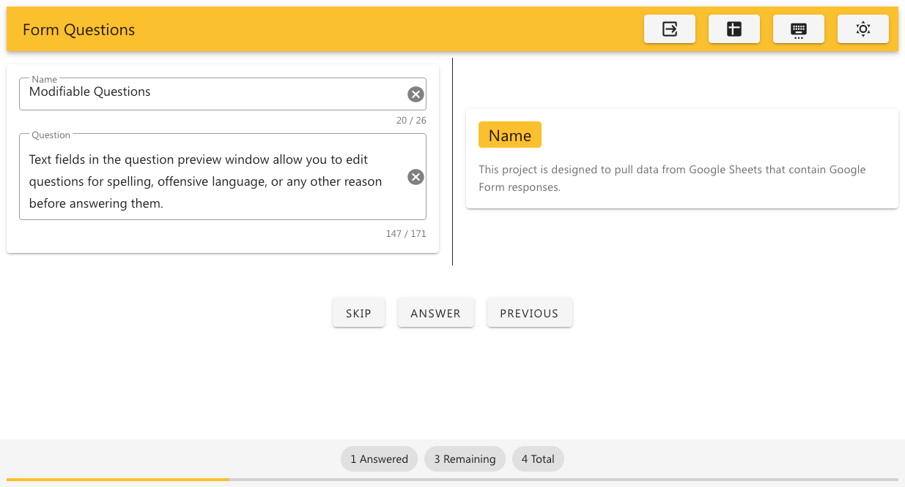

# Form Questions

This project aims to provide a simple and clean interface for displaying and
responding to questions asked through a Google Form, which are logged in a
Google Sheet. Currently, it is designed to handle forms with a "Name" field of
26 characters, and a "Question" field of 171 characters, in that order.

The current intended use-case is to screen-share the portion of the window
containing the question on the right-hand side of the window. Ideally, in the
future I would like to split the tool into two browser windows, with one being a
"presentation" window, and the second being a "presenter mode" window, so that
the display window can be opened directly as a browser source in a streaming
program.

## Screenshot



## Note on Security

This application is built as a single-page [Svelte](https://svelte.dev/) application.
There is no client/server architecture, and so API credentials are visible in
the client-side application. This means that this project should not be deployed
to multiple users as a production service, unless you trust them all with your
API credentials.

This design is intentional and was intended for the sake of simplicity and
performance. However, if there is interest in modifying the architecture to avoid
the drawbacks outlined above, feel free to open an issue or pull request.

## Usage

To get started, clone the repository and rename or copy the
[`.env.example`](./.env.example) file to `.env`, then fill in all fields under
the `# Required` heading. You will need to supply a client ID and API key for a
Google Cloud Platform project with the Sheets API in its scope, and
http://localhost:5000 as both an authorized JavaScript origin and redirect URI.
Visit https://console.cloud.google.com/apis/credentials to set this up.

Please note that the optional `UPDATE_FREQUENCY` environment variable refers to
the frequency with which the data from the the Google Sheet will be updated, in
**milliseconds**.

Once you have filled the file out, you should then be ready to go! There are
currently three methods of running the application, as outlined below.

Also note that once you have the application running, the Spreadsheet ID that
you must enter to select a spreadsheet is the bold part of the following URL:
[https://docs.google.com/spreadsheets/d/**1BxiMVs0XRA5nFMdKvBdBZjgmUUqptlbs74OgvE2upms**/edit#gid=0](https://docs.google.com/spreadsheets/d/1BxiMVs0XRA5nFMdKvBdBZjgmUUqptlbs74OgvE2upms/edit#gid=0)
(this example sheet is taken from Google's Sheets API Quickstart tutorial).

### On the Host OS

To run the application directly, first clone the repository and `cd` into it:

```bash
git clone https://github.com/mtoohey31/form-questions
cd form-questions
```

Then after filling out the `.env` file as explained above, run the following
`npm` commands to install all necessary dependencies, build it, and run it:

```bash
npm install
npm run build
npm start build
```

The project will then be available on http://localhost:5000.

### Via Docker

There are also two ways of running the application with Docker. Each offers
advantages or trade-offs to security in exchange for performance.

#### Dynamic Configuration

If built and run with this method, credentials will need to be mounted when
the container is run, and the project will be rebuilt each time. This has the
advantage of storing no credentials inside an unused container, they will only ever
be stored in the `.env` file, or inside the container when it is running. This
also allows you to change environment variables in the config file without having
to rebuild the entire container, but it comes at the cost of the container running
`npm run build` every time the container is started. This doesn't take long though
in the current size of the project.

To run with this method, clone the repository and `cd` into it:

```bash
git clone https://github.com/mtoohey31/form-questions
cd form-questions
```

Then fill out the `.env` as previously explained and build the container using
the appropriate Dockerfile:

```bash
docker build -f Dockerfile.dynamic -t form-questions .
```

Finally, run the container, mounting the `.env` file in the appropriate location:

```bash
docker run --rm -d -v $PWD/.env:/app/.env -p 5000:5000 form-questions
```

The specific command above assumes that your current working directory is your
local clone of this repository. The project will then be available on http://localhost:5000.

#### Static Configuration

With this method, the `.env` file is defined before the image is built, and so
edits to the `.env` file require the container to be rebuilt. In addition, the
credentials are stored inside the container even when it is not running, which
some may consider undesirable.

The process for running in this way is quite similar to the previous option, and
is as follows:

Clone the repository and `cd` into it:

```bash
git clone https://github.com/mtoohey31/form-questions
cd form-questions
```

Then fill out the `.env` as previously explained and build the container using
the appropriate Dockerfile:

```bash
docker build -f Dockerfile.static -t form-questions .
```

And finally, run the container:

```bash
docker run --rm -d -p 5000:5000 form-questions
```

The project will then be available on http://localhost:5000.

Note that you will not need to mount the `.env` using this method as it is built
into the container.

## Contributing

If you would like to contribute, run these commands to clone the repo and run it
in dev mode:

```bash
git clone https://github.com/mtoohey31/form-questions
cd form-questions
npm install
npm run dev
```

Any changes written to files should automatically be reloaded and displayed.

Note that if you would like to modify or test anything where you need the
project to have access to questions from a Google Sheet, you will need
to fill out the `.env` file as previously explained above.

As mentioned at the start of the `README`, the main thing I'd like to add is
separate "presentation" and "presenter mode" windows. If you would like to
suggest a way of going about this that allows one window to be opened in a
browser and the other to be opened separately, in OBS for example, let me know!

There is also a list of other changes I would like to make/have made in the
[TODO.md](./TODO.md) file.

I'm a bit of a Svelte newcomer right now, so if there are better ways to do things
than the way I have done them, feel free to suggest or contribute a refactor that
would improve things!
